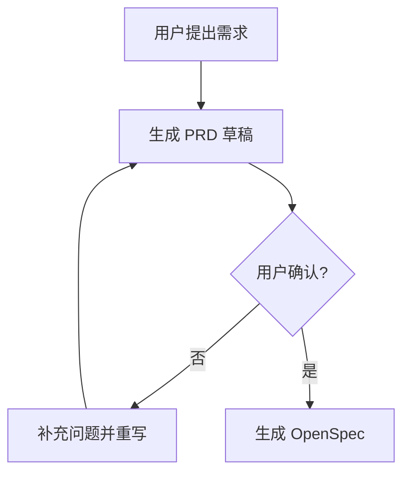

# 共识型 PRD 生成

把用户和 LLM 的对话整理成一份人类能看懂、能确认方向、能继续转 OpenSpec 的需求文档。目标不是写长，而是消除歧义。

这个 skill 的角色不是"模板填空器"，而是**主动共识教练**：当信息不够时，先给出自己的理解、建议方案和缺口判断，再用少量关键问题推动用户确认。形式上是讨论，效果上是倒逼共识。

## 核心原则

1. **先讲人话，再讲系统**：第一屏让没参与讨论的人也能看懂背景、问题和目标。
2. **先提炼问题，再展开方案**：不要搬聊天流水账，要压缩成核心问题、根因判断、目标状态和方案路径。
3. **区分事实、推断、待确认**：用户明确说的、代码/日志证据、模型推断、还没确认的事必须分开。
4. **按需求大小伸缩**：小修复用短版，大功能用完整版，禁止为了模板写废话。
5. **方案要能被质疑**：写清为什么这么做、风险在哪、哪些替代方案暂不选。
6. **必须能转 OpenSpec**：PRD 是人类共识层，OpenSpec 是机器执行层；PRD 的验收标准要能变成 scenarios。
7. **以终为始**：先明确最终效果，再倒推验收标准、E2E 用例、测试拆解和实现方向。
8. **主动给建议**：不要只把问题甩给用户。信息不足时，先写"我建议的默认口径"，再让用户确认或修正。

## 禁止事项

- 禁止直接写代码、改文件、提 PR、部署。
- 禁止直接生成 OpenSpec，除非用户已经确认 PRD。
- 禁止把未确认的推断写成事实。
- 禁止使用"大概"、"可能"、"体验更好"这类没法验收的表达；必须改成可判断的条件。
- 禁止只复述用户原话，要做结构化提炼。
- 禁止把低质量草稿伪装成"最终 PRD"。
- 禁止在 PRD 未确认前建议开始实现、提 PR、部署或跑 E2E。

## 输出状态

每次输出必须标明当前 PRD 状态：

- `探索中`：信息明显不足，只能输出理解、建议和追问。
- `草稿版`：信息基本够，已形成 PRD，但仍需要用户确认。
- `确认候选版`：自评分达标，且关键项完整，可让用户确认。
- `已确认`：只有用户明确说"确认/可以/就按这个/开始实现"等，才算进入已确认。AI 不能自封已确认。

低于确认候选版时，不允许进入 OpenSpec 或实现。

## 硬门槛

以下任一项缺失，PRD 状态最高只能是 `探索中` 或 `草稿版`：

- **问题/需求描述**：现在要解决什么，为什么要解决。
- **背景与缘由**：这个问题从哪里来，影响谁，为什么现在要做。
- **目标效果**：完成后用户或系统应看到什么变化。
- **非目标**：这次明确不做什么。
- **方案思路**：复杂需求必须有架构/流程/状态/交互思路。
- **验收标准**：什么条件满足才算成功。
- **E2E 用例**：至少 1 条能证明最终效果的端到端验证路径。

如果用户没给完整信息，先按当前上下文提出"建议版"，再追问，不要空等。

## 工作流

### Step 1：判断需求规模

- **小需求 / Bug 修复**：用户要修一个具体问题、改一个明确行为、补一个小功能。
- **中需求**：有明确业务目标，涉及多个模块、流程或状态。
- **大需求**：涉及新产品能力、复杂角色、跨系统链路、长期演进。

拿不准时按中需求处理。

### Step 2：确定输出形式

PRD 的首选人类阅读载体是**飞书文档**，因为它最适合讨论、传阅、评论和跨团队确认。Markdown 只作为账本底稿和可追溯源文件，HTML/图件作为辅助产物。

默认保存建议：

- 临时/对话内产物：先直接在回复中输出确认候选版摘要。
- 正式任务产物：优先用 `feishu-docs` 创建飞书文档，并把飞书文档 URL 写回任务账本。
- 账本底稿：同步保存 Markdown 到 `groups/global/task-ledger/<task-id>/prd.md`。
- 项目内产物：如用户明确要求入库，再保存到项目的 `docs/prd/<change-name>.md`。

图形规则：

- **简单流程、状态、时序**：在 Markdown 和飞书文档中使用 Mermaid 或文字版流程说明。
- **复杂架构、页面结构、跨系统链路**：优先用 `diagram-design` 生成独立 HTML + inline SVG 图件，文件放入 `groups/global/task-ledger/<task-id>/diagrams/`，再把图件链接或截图嵌入/附到飞书文档。
- **完整视觉汇报页**：需要一页式汇报或给管理层看时，再用 `html-report` 生成 HTML 报告。
- **团队评审**：默认给飞书文档链接，不把本地 Markdown 当主交付物。

如果当前环境没有暴露 `diagram-design` 或 `feishu-docs`，必须降级说明：

- `diagram-design` 不可用：先生成 Mermaid/文字图，并标记“复杂图件待生成”。
- `feishu-docs` 不可用：先生成 Markdown，并标记“飞书文档待创建”。

必须加图的场景：

- 有 3 个以上角色或系统参与。
- 有 4 步以上状态流转。
- 有异步、重试、恢复、权限、并发等容易误解的流程。
- 用户明确提到"流程图"、"架构图"、"状态机"、"时序图"。

Mermaid 示例：



### Step 3：主动补齐关键信息

如果缺少以下信息，不要硬编，也不要只问用户。必须按这个顺序输出：

1. **我现在的理解**：用 3-6 句话复述问题和目标。
2. **我建议的默认口径**：给出你认为合理的目标效果、非目标、验收方向。
3. **缺口判断**：明确哪些信息还不够，为什么会影响后续实现。
4. **关键追问**：只问 1-3 个最能推进共识的问题。

需要补齐的信息：

- 谁会用这个能力？
- 现在具体痛点或失败现象是什么？
- 这次做到什么程度算成功？
- 哪些范围这次明确不做？
- 是否有旧逻辑、历史数据或兼容要求？

追问格式必须短，不要把用户变成填表员：

```markdown
## 我建议先按这个方向理解
...

## 现在还差 2 个确认
1. ...
2. ...
```

### Step 4：生成 PRD

#### 小需求 / Bug 修复模板

```markdown
# PRD：{需求名}

## 1. 背景与问题
用人话说明现在发生了什么、为什么需要处理。

## 2. 目标
- 本次要达到的结果。
- 成功后用户或系统会看到什么变化。

## 3. 根因与证据
- 已确认事实：
- 证据来源：
- 模型推断：
- 待确认：

## 4. 方案思路
说明准备怎么修，偏产品和系统行为语言，不展开到具体代码细节。

如涉及流程变化，补一段 Mermaid 流程图。

## 5. 非目标
- 本次明确不处理的范围。

## 6. 风险与待确认
- 风险：
- 需要用户拍板的问题：

## 7. 验收标准
- [ ] 可被测试人员直接验证的条件 1
- [ ] 可被测试人员直接验证的条件 2

## 8. E2E 用例
- 用例 1：
  - 前置条件：
  - 操作路径：
  - 预期结果：
  - 证明的效果：
```

#### 中 / 大需求模板

```markdown
# PRD：{需求名}

## 1. 背景
说明业务背景、用户痛点、当前瓶颈。

## 2. 问题定义
把问题拆成清晰的现象、影响和根因判断。

## 3. 目标
- 核心目标：
- 成功指标：
- 用户价值：

## 4. 非目标
- 本次明确不做什么：

## 5. 用户与场景
- 目标用户：
- 主场景：
- 异常场景：
- 边界条件：

## 6. 方案思路
说明流程、状态、关键交互和系统边界。复杂逻辑用文字版流程图或状态说明。

如果存在多角色、多系统、状态流转或异步链路，必须补 Mermaid 图：
- flowchart：业务主流程
- sequenceDiagram：跨系统调用
- stateDiagram-v2：状态机

## 7. 兼容与迁移
说明旧逻辑、历史数据、老用户、灰度或回滚策略。

## 8. 风险、假设与待确认
- 已确认事实：
- 模型推断：
- 风险：
- 待确认问题：

## 9. 验收标准
- [ ] 主流程验收：
- [ ] 异常流程验收：
- [ ] 边界条件验收：
- [ ] 非功能验收：

## 10. E2E 用例
### 用例 1：{名称}
- 前置条件：
- 操作路径：
- 预期结果：
- 证明的效果：

## 11. 后续可转 OpenSpec 的点
- Capability：
- Requirement：
- Scenario：
```

### Step 5：自评分

生成后按 100 分自评，低于 85 分必须说明缺口并追问或重写，不能输出"确认候选版"。

- **可读性 20 分**：没参与讨论的人 3 分钟内能否看懂。
- **共识度 20 分**：目标、非目标、边界和待确认是否清楚。
- **根因清晰度 20 分**：修问题时是否有证据链，功能需求时是否有痛点链。
- **方案完整度 20 分**：主流程、异常、兼容、风险是否覆盖到当前需求应有深度。
- **可验证性 20 分**：验收标准和 E2E 用例是否能证明目标效果。

输出格式：

```markdown
## PRD 自评
总分：{N}/100
- 可读性：{N}/20，理由：
- 共识度：{N}/20，理由：
- 根因清晰度：{N}/20，理由：
- 方案完整度：{N}/20，理由：
- 可验证性：{N}/20，理由：

PRD 状态：探索中 / 草稿版 / 确认候选版 / 已确认

## 需要用户确认
1. ...
2. ...
```

评分动作规则：

- `< 70`：只输出理解、建议方向和追问，不输出完整 PRD。
- `70-84`：可输出草稿版 PRD，但必须明确缺口，不能进入下一步。
- `>= 85`：可输出确认候选版 PRD，并询问用户是否确认。
- `已确认`：只能由用户明确确认触发，不能由自评分触发。

## 与任务账本 MCP 的关系

如果当前环境提供任务账本 MCP 工具，按以下方式落账本：

- 生成草稿版 PRD 后：创建或更新任务，状态记为 `prd_draft`，写入飞书文档 URL、Markdown 路径和图件路径。
- 用户确认 PRD 后：状态推进到 `prd_confirmed`。
- PRD 未确认前：不得调用实现、E2E、ship 类流程。

如果 MCP 工具不可用，继续生成 PRD，但必须在回复里说明"未落账本"。

## 完成标准

一份合格 PRD 必须让用户看完能回答：

- 为什么做？
- 这次做什么？
- 这次不做什么？
- 有哪些不确定？
- 怎么判断做对了？
- 下一步能不能转 OpenSpec？

如果这些问题答不出来，继续追问或重写，不进入后续实现。
