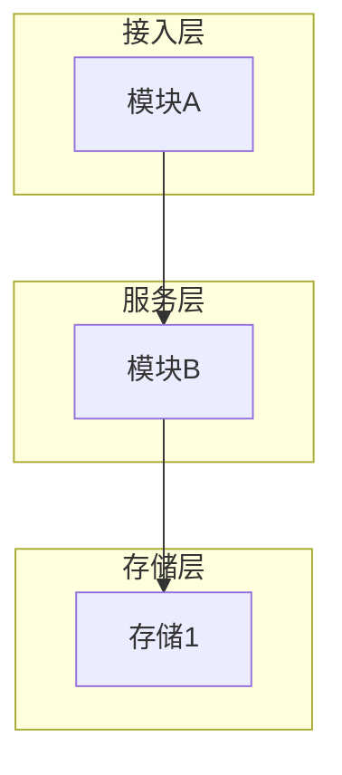
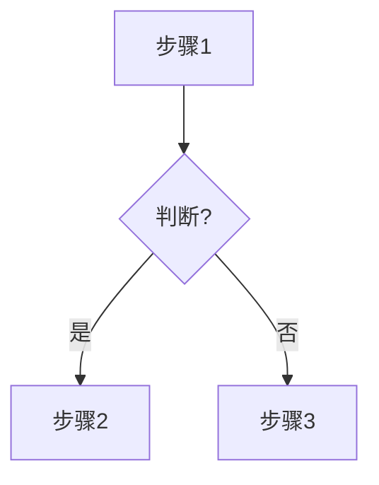
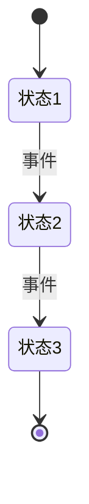

# PRD 通用写作规则（prd-core）

> PRD 流水线的通用写作规则活页。按 prd-pipeline.md 工序卡指定的节取用,没有工序读全文。

## 适用范围与判定

⚠️ 若用户仅要存档 / 总结 / 讨论纪要等非 PRD 产物，可跳过本模板按用户意图自由叙述，不强制套章节结构。

PRD 按 NINE 10 章结构写；简单需求按体量裁剪，不必套满 10 章。

内部识别用户输入类型，不再询问用户选择：

- 新建 vs 改写:判据=用户意图。要求更新某篇**已有 PRD**→改写;给的是需求素材(MRD/讨论稿,即使飞书链接)→新建,素材绝不被写回。拿不准问用户。
- 若用户未提供可作为原文的 PRD 或需求材料，仅描述一个新需求 / 功能想法 / 业务目标，则按「新建需求文档」处理：从零生成完整 PRD，不参考原文。
- 若输入同时包含原文和新增诉求，优先按「改写原文档」处理，并将新增诉求合并进对应章节。

## 骨架机制

### PRD 类型识别

生成或改写 PRD 前，先内部识别需求类型，再按各域模板的写作触发条件决定章节详略，不需要追问用户。

| 需求类型 | 识别特征 | 章节处理倾向 |
| --- | --- | --- |
| C 端需求 | 面向用户行为、用户体验、转化、增长、交易链路、内容消费、活动运营等 | 更关注用户调研、竞品分析、交互流程、埋点、数据评估、灰度实验 |
| 中后台 / 后端 / 内部改造需求 | 面向运营、客服、商家、审核、配置、管理后台、内部工作台，或纯接口、服务、数据、任务、规则引擎、内部流程优化等 | 必须写清权限、流程、配置、状态、操作记录、功能规则、边界场景；用户调研、竞品、埋点在无触发条件时可以不写 |

若一个需求同时包含 C 端和中后台 / 后端支撑，按「用户链路 + 后台/后端支撑」分别写清，不要只按单一类型裁剪。

### 需求复杂度识别

识别 C 端 / 中后台类型后，还要继续内部判断需求是「简单需求」还是「复杂需求」，再决定第六章写法。

| 复杂度 | 识别特征 | 第六章写法 |
| --- | --- | --- |
| 简单需求 | 单模块、单链路、功能点少、状态少、上下游依赖少、无复杂交互 | 用一个功能说明表写清：模块 / 功能 / 功能详细与说明（不设序号列）；图形要求只保留流程图 |
| 复杂需求 | 多模块、多链路、多角色、多状态、依赖多个系统或页面、存在复杂交互 / 状态 / 边界 | 按小章节逐个功能点写；除流程图外，至少还要有一个额外图（原型图 / 截图 / 交互图 / 状态图等） |

### 章节锚定：A-D 分类机制

各域模板把章节按约束强度分四类锚定标题：**A=必写、B=按触发条件、C=推荐、D=按需**，具体章节清单在各 domain 模板。实测发现头部 / 版本变更 / 埋点 / 非功能等基础章节常被跳过（chat 5096dddd 实测 10 章里 4 章直接缺失），输出时按域模板的锚定清单核对章节标题，避免遗漏。

内容生成原则（事实型 vs 设计型）见「通用原则：事实型 vs 设计型」节。

## 事实来源透明化

输出可验证的事实结论（字段名 / 接口路径 / URL / 改动量估计 /「纯前端」「无需后端」类判断 / 业务流程 / 现状陈述）时，让用户能识别每条结论的来源：

- **已核实** — 本次会话查过代码确认
- **原文复述** — 用户给的飞书 PRD / wiki 原文照搬
- **未核实推论** — 凭对话历史 / 命名习惯 / 印象推断

含未核实推论时，建议主动问用户要不要现在查代码确认。PRD 落档若涉及未核实推论，文档顶部加一段「来源说明」按节归类。建议而非强制——结论简单 / 用户催「直接说」/ 来源清晰时自主裁剪。

## 代码引用边界

**专有名词原文保留**：发现原文术语有歧义 → 第四章名词解释澄清，不改正文。

PRD 主受众 = PM / 业务 / 运营。**主体功能 / 流程 / 描述用业务语言**。

哪些算"技术味道太重"（chat `89a48f63` 实测 4 类典型违规）：

| 类型 | ❌ 反例 | ✅ 改成 |
|------|--------|--------|
| 仓库名 / 服务名 | `ms-order-reverse` / `ms-goods` / `ms-trade` | 用 `SKILL.md` 业务图谱速查表的五大业务域命名（订单域 / 商详域 / 汇金域 / 履约域 / 基架域），需要细分时按业务子域（如"订单域 · 退货规则配置"）|
| Go/Java 方法名 | `GetWarranty()` / `Match()` / `_fill_table_cells` | 业务动作（"获取质保信息" / "匹配规则"）|
| 枚举字面值 | `JiuwuWarrantyTagRuleType_180 = 3` | 业务概念（"180 天质保类型"）|
| 内部字段名作主语 | `warranty_days 字段` / `Warranty.taxRate` | "质保天数" / "税率" |

**例外（1-2 处简短辅助即可）**：

- 字段名作为**触发条件的限定符**：✅ "选 180 时同步存入 warranty_id 字段"
- 第四章名词解释澄清术语对应

业务域名权威源：SKILL.md「代码查证」段的 5 域速查表（常驻）；更细子域规则 Read 本目录的 `business-map.md`（与本文件同目录）。

自问："这段代码能帮 PM 更好跟研发讲清楚需求吗？能 → 留；不能 → 删。"

**模板变量与标记语法边界**：前台文案占位写 `{var}`（如「预计售出：¥{price}元」，实测渲染安全）；**禁 `${`**——落档通道把 `$`+`{` 组合解析为公式，正文会渲染成乱码；但**行内上色标记**（`<span>`/`<font>`）与渲染层代码禁止出现在正文（会原样渲染成技术垃圾；行内颜色一律由出品工序机器施加。块级结构 XML——callout/whiteboard/`<td background-color>`——是写作工序合法产物，不在此列）。UI 文案示例的唯一合法写法=「预计售出：¥{price}元」——「」包裹纯文本+单花括号变量，不带任何标签、不包行内代码。行内代码=反引号唯一写法（落档通道原生转换，实测 dryrun_r3），`<code>` 标签同属禁写标记（手写=双重包裹渲染成字面垃圾，R3 实证 3 处全中）；**XML 整表 `<td>` 内反引号不转换**（字面显示，实测）——表内技术字面量用纯文本或加粗。

## 通用原则：事实型 vs 设计型

所有章节细则都遵循本原则。

> 区分两类字段，行为分开：
>
> - **事实型**（背景 / 价值 / 用户调研 / 竞品 / 业务数据）：整理为主，沿用用户/飞书原文，**不编造数字、不偏离原文加新维度**。事实**不足 / 存疑 / 矛盾**时（**包括做设计型工作时发现的**）→ 主动追问用户或主动调代码工具验证，不编造。
> - **设计型**（功能点 / 流程图 / 状态机 / 交互 / 字段命名 / 范围）：LLM 可**主动设计 + 扩写**，模糊原文时大胆施展，但 💭 暴露假设让用户挑刺。

## 写作纪律（通用）

人写习惯纪律（反 AI 味，照做就不"AI 味"）：

1. **格式服从内容复杂度**，不一套到底。
2. **聚焦克制**：全篇围绕核心决策，不为显得完整堆无关模块；单条说明一两句话。
3. **迭代对照**：用「是否与现状不同 ✅/❌」列 或「(新增)」前缀，把本期变更和沿用分清。
4. **举真实 case**：真实单号 / 编码 / ID / 名称，不用"示例1/参数A"。
5. **现状量化对照**：价值/指标给"现状 + 目标"两栏。
6. **协作缺口显式标待办**：`⚠️ 待与 X 对齐 · Owner · 预期时间`，不假装谈妥。
7. **没内容就省**，不为填满硬凑图/表。
8. **验收标准按业务路径分组**（主链路 / 异常链路 / 存量 / 上线指标），每条可验证。
9. **章节编号按实际出现连排**：模板里的章号（五章/6.3/§8 等）是**身份标识非排位**——条件章跳过后，后续章补位改号（如模板"九"未触发时，"十、AI 审视"落稿写"九、AI 审视"），6.x 子编号随实际主章号；一级章标题写成 md `##` 标题。人写文档不留空号（R3 实证 八→十 跳九被用户点名）。
10. **异常分支写全**：每个失败/超时/查不到分支给「阈值 + 降级动作 + 落什么日志」三件套，不只写 happy-path（AI 只写顺的那条；接各域模板功能说明章的异常行）。

**命名提示**：给引用项/来源/方案起名用阿拉伯数字（来源1/方案2），不用圈号①②③（圈号串会被出品检查当假列表拦下）。

## 6.1a 选图决策

**先静后动（复杂 / 大需求必读）**：先画一张**产品架构图**（静态：有哪些系统 / 模块 / 数据存储 + 谁依赖谁），再画流程 / 时序图（动态：用户 / 消息怎么流）。架构图回答"有哪些东西、怎么摆"，流程 / 时序图回答"怎么流"——复杂需求两者都要。命中任一即需架构图：**新增系统对接** · **改动跨 ≥3 个系统** · **引入新模块 / 新状态机** · **部署拓扑变**。单点小改动不需要。

**何时画（流程 / 时序类）**：方案含多角色 / 多状态 / 多系统协作时。简单线性流程（节点 ≤ 5 + 无分支）可省或用代码块降级。

**§6.1 正文必须有一行业务概括引导**（不能只写"见文档末尾画板"7 个字）：

✅ "本图展示用户从进入商品详情页到看到 180 天质保标签的完整路径，涵盖 warranty 字段判断、标签渲染、未命中规则的兜底降级三个分支。"
   ← 业务概括 + 与 §6.2 衔接

❌ "（见文档末尾画板）"
   ← 单凭这 7 个字 PM 不知道画板里画的是什么，且断了 §6.1 与 §6.2 的视觉连续性

**图类型选择**：

| 图类型 | mermaid 语法 | 适用场景 |
|--------|-------------|---------|
| **产品架构图** | `flowchart` + subgraph 分层 | 静态结构：系统 / 模块 / 数据存储 + 依赖关系（复杂需求先画这张，再画流程）|
| 业务流程图 | `flowchart TD` | 单角色、线性主流程 |
| 泳道图 | `flowchart LR` + subgraph | 多角色协作（用户 / 商家 / 系统 / 客服）|
| 时序图 | `sequenceDiagram` | 系统间接口调用顺序 |
| 状态机 | `stateDiagram-v2` | 订单 / 商品 / 审核状态流转 |
| 用户动线图 | `flowchart LR` + 椭圆起终点 + 菱形决策 | C 端用户体验链路（**不用 `journey`，飞书画板不支持**）|
| 决策树 | `flowchart TD` + 菱形 | 复杂分支逻辑 |

> **按上表逐行判断该画哪种，别默认某一种**；架构图与流程 / 时序图不是二选一——复杂需求先架构（静）后流程（动）。

## 6.1b mermaid 语法与视觉规范

**语法骨架（只示范 mermaid 怎么写；占位名 / 层数 / 节点数都要按你的真实需求替换——落图时 `模块A`/`步骤1`/`状态1` 这类占位名必须换成真实系统 / 模块 / 状态名，别套用下面的数量与命名）**：

产品架构图（分层 subgraph）：


业务流程图：


状态机：


**Mermaid 安全语法（必读，避免渲染失败）**：

节点标签含 `(` / `)` / `:` / `/` / `&` / `,` / `"` 等特殊字符时，**必须用 `["..."]` 包裹整个标签**，否则飞书解析器把括号当形状切换符号，从该行起整张图丢失。

```
✅ 正确：A["接口路径: /api/orders"] --> B["履约单中心 (Fulfillment)"]
❌ 错误：A[接口路径: /api/orders] --> B[履约单中心 (Fulfillment)]
```

不确定时一律用引号包裹（永远安全）。

**飞书 PMO 视觉规范（让画板长得专业）**：

- **节点形状**：矩形 = 步骤 / 菱形 = 判断（结尾带 `?`）/ 椭圆 = 起终点 / 加粗矩形 = 里程碑产物
- **节点数量上限**（保持可读）：泳道 ≤30 / 时序 ≤20 / 动线 ≤10
- **标签风格**：中文 2-5 字；连线 是/否 / Yes/No 1-2 字
- **配色**：3-4 色为限（mermaid 默认 theme 已配好，不手动指定）

## 6.2 交互原型图

C 类章节。有 UI 改动时以**对照结构**组织——优先表格（维度自定，常见如 场景/改前/改后/差异，列名不强制），或左右分栏并置；**截图必须放进所属场景的单元格/分栏内，与文字同行对照；禁止在表格下方或正文里平铺堆图**（语料正例 `PRD-367385` grid 并置 / `PRD-364124` 多列对照；反例=上下堆图）。纯后端 / 纯内部工具可跳过。

## 容器块选用

判据 = 可跳读性：

| 内容 | 容器 | 锚点 |
|---|---|---|
| 现状/已有逻辑参考、「注：」补充、口径展开与示例、待确认问题、产品思考/方案权衡、「本期不涉及」边界 | **引用容器（=旁注层：读者跳过它仍能读通需求主干，评审/测试才需要；语料 60% 文档在用）** | `PRD-326702`/`PRD-339734`/`PRD-360897` |
| 一句话需求摘要/方案原则/核心结论（不可跳过的） | callout + 📌 | `PRD-351647`/`PRD-364124` |
| 背景解释/前置说明 | callout + 💡 | `PRD-331405`/`PRD-364102` |
| 本期目标/预期收益/实验结论 | callout + ✅ | `PRD-364591`/`PRD-364120` |
| 正文段落、功能细则主干 | 普通文本（不进容器） | — |

> callout 的语义靠 **emoji** 不靠背景色（语料 1/3 的 callout emoji 是随手装饰——别学）；分割线无共识用法，不立规则。

## 颜色与容器语义

色板=团队惯例(用户校准版,2026-07-13;与语料统计冲突时团队惯例优先);颜色是例外不是默认。

**克制三则（先读再用色）**：①拿不准用什么色 → 不用色，语义交给结构和加粗；②量级参照：单篇十处上下（语料中位数 7 处），长文档约 2~3 处/百块——颜色的价值在稀缺，处处上色等于处处没说；③文档用了 2 种以上语义色 → 文首一句话声明图例。

**主次分工（团队惯例）**：背景高亮是主力（面强调：整句/整格），字色只留红/绿一对（点强调：短词、数字的正负方向）。语料佐证：底色 1482 次 vs 字色 923 次，黄底覆盖 100/207 篇。

**落档色值（淡色）**：所有背景高亮——S9 机器施加的行内底色 + S4 手写 `<td background-color>` 单元格底色——一律用 `light-{色}` 淡色变体（`light-yellow`/`light-red`/`light-green`/`light-blue`；灰用 `light-gray`）。大红大黄大绿饱和度太高、可视化差。字色（红/绿点标）无淡变体，保持基础色。

| 内容类型 | 颜色 | 锚点 |
|---|---|---|
| 严重问题/**硬约束/禁止项**/「以…为准」易错提醒/拦截（必须看；决策成对时 vs 绿底；版本 diff 高亮属改写场景局部图例,配文首声明） | 红底 | `PRD-339734`/`PRD-364416`/`PRD-348827` |
| 警告/风险/需注意（阈值、范围限定确需强调时也归此;拿不准该不该强调 → 不用色） | 黄底 | `PRD-350951`/`PRD-348293` |
| 正向的事情（价值章的正向经验/实验结论强调、表格中正向块的填充） | 绿底 | `PRD-341935` |
| 进行中的事项（低频,仅需重点区分状态时用） | 蓝底 | — |
| 负向/禁止/无效的**状态或数字点标**（「暂未支持」「下降 37 单/天」），与绿字配对 | 红字 | `PRD-367144`/`PRD-351829` |
| 正向/有效的**状态或数字点标**（「+2.4pp」「上升 10 单/天」），与红字配对 | 绿字 | `PRD-367144`/`PRD-351829` |

> **背景块=面强调，红/绿字=点状态**——颜色本质是给读者的注意力分层；硬约束级内容一律红底，红字只做配对点标不再承担"必须看"。
> **旧类目迁移**：界面文案原文 → 「」书名号唯一标记（不再上蓝字）；旁注/现状说明/演算示例 → 引用块（不再上灰字）。
> **局部图例优先**：域模板分版底色（V2黄/V3绿/V4蓝）与域模板的表格状态编码底色（绿=正常展示/黄=新增列）都是**局部图例体系**，文首/表首声明后在其作用域内优先于本表；嵌套重叠时就近/更小作用域优先。**用局部编码底色的表格,表首必须一句局部图例声明**(不声明=读者按全局色板误读)。
> 行内样式两条：**技术字面量**（字段名/枚举值/表名/表达式，须逐字对齐不可意译）用行内代码（`PRD-360785`/`PRD-364416`）；**下划线在语料中无共识语义**（多为个别作者习惯），别依赖它传达含义，强调用加粗。

## 一、二章写作规范

**一、需求背景** —— 飞书 PMO 三段，按需挑：

- **产品/数据现状**：沿用用户/飞书原文；用户明示要补才用代码验证补全
- **用户调研**：LLM 不编造，无素材直接跳过
- **竞品分析**：可指出友商已有公开同类功能（事实陈述）；不编造转化率/MAU/营收等具体数据

**二、需求价值** —— 论证「为什么值得做」，定性或定量，**不能只写"提升体验"**：

- **业务价值**：解决什么业务痛点、带来什么结果（如：减少客服工单、提升转化、降低差评/退款）。有数据就引数据（沿用用户/飞书原文，不编造）；无数据就定性说清受益方与受益点。
- **用户价值**：目标用户是谁、他们原来卡在哪、改完后体验怎么变。
- **现状量化对照**：价值/指标给「现状 + 目标」两栏。
- **护栏负向指标**：给正向目标时，同时写「不能被伤害」的负向指标；只报正向 = AI 味。
- **不达标反例**：❌"提升用户体验" / "优化流程" —— 空泛无对象无结果，等于没写。

两条内容质量信号（各章都适用）：**量化带分布+头部集中度**（`PRD-348615`：薅羊毛 58人/817笔/6.75万，头部 13人贡献 85%——不是笼统"部分用户"）；**价值给可验算算式**（`PRD-333149`：日均 4102 单 ×15.3%×8.9%… = 1810 元/日，每个乘数点名来源；基线未知留区间不编数）。

## AI 审视（十章规范）

D 类章节，有洞察才写。PM pre-mortem 视角：「如果按这份 PRD 实现，哪里会出问题，哪里可以更好」

三维度 × 正负双向（**各维度有发现才写，无发现的维度省略**）：

- **逻辑**：✅ 可以更好 / ⚠️ 存在问题
- **功能与代码**：✅ 代码支撑或有复用 / ⚠️ 约束 / 边界 / 实现风险（research 有产出时写判断，不只陈述事实；**仅写判断结论，不贴代码片段**）
- **范围**：✅ 漏掉但应一起做的 / ⚠️ 定了但不该定的

改写路径：三维度前可先输出「文档补充说明」（已补充的 Critical/Warning 项）。

## 铁律与质量标准（审计完整版）

> ⚠️ 本节仅 S7 对抗自审加载——锚点反例进生成会诱发照抄。

### 三条铁律（AI 几乎不会做，判别力最强）

1. **诚实认盲区**：相关性数据主动写「相关≠因果」并给验证方案；没定的点收敛成「待研发/评审确认」清单，别装全懂。AI 只顺着结论堆佐证。锚点 `PRD-368610`（相关≠因果 + 灰度验证）、`PRD-362854`（字段映射待研发联调确认）。
2. **异常分支写全**：不止写顺的那条路——每个失败/超时/查不到分支给「**阈值 + 降级动作 + 落什么日志**」三件套。AI 只写 happy-path。锚点 `PRD-362854`（超时 200ms → 降级常规流程 + 记 order_id/异常码/时间戳；覆盖命中/非命中/异常降级三分支）。
3. **护栏负向指标**：给正向目标时，同时写「不能被伤害」的负向指标。只报正向 = AI 味。锚点 `PRD-365583`（提单率不得低于改版前基线、三合一创单率不得因预约模块下降、一键转卖共用模块不得显著负向）。

> 另外两条内容质量信号（各章都适用）：**量化带分布+头部集中度**（`PRD-348615`：薅羊毛 58人/817笔/6.75万，头部 13人贡献 85%——不是笼统"部分用户"）；**价值给可验算算式**（`PRD-333149`：日均 4102 单 ×15.3%×8.9%… = 1810 元/日，每个乘数点名来源；基线未知留区间不编数）。

**每条功能说明的质量标准**：

- 触发条件 + 处理逻辑 + 返回结果 三段齐全
- 边界 / 异常在同一行描述（"调用 X 失败时降级展示 Y"），不另起一行
- 涉及状态机：列出全部合法状态 + 流转条件（含禁止流转，如"已发货后不可取消，必须走退款"，不能只写部分）

⚠️ 反例 — 别拆成 `####` + bullet（chat 5096dddd 最严重错误）：

```
❌ #### 4.2.2 [业务后台]
   - **[功能模块 A]**：[新增/修改功能描述]
   - **[功能模块 B]**：[新增/修改功能描述]

❌ #### 4.2.3 App 端
   - **[页面 A]**：[展示/交互改动]
   - **[页面 B]**：[展示/交互改动]
```

← 多模块拆 `####` + bullet：失去 域·模块 / 详细说明 / 交互图 的逐行对照；PM 滚屏对比困难。
