## Context

NanoClaw 当前通过 `@anthropic-ai/claude-agent-sdk` 的 `query()` API 运行 agent（`container/agent-runner/src/index.ts`）。Anthropic 2026-06-15 起将 Agent SDK 调用独立计费，与交互式 CLI 配额分离。

当前架构：
```
container-runner.ts → spawn node agent-runner/dist/index.ts
  → agent-runner 读 stdin JSON (ContainerInput)
  → 调用 query() 启动 claude-agent-sdk
  → stdout 输出 OUTPUT_START/END 标记包裹的 ContainerOutput JSON
  → IPC 目录轮询实现多轮对话
```

CLI 模式需在 agent-runner 内部增加一条并行路径：直接 spawn `claude` CLI 进程，用 stdin/stdout JSON 流通信，绕过 Agent SDK。

## Goals / Non-Goals

**Goals:**
- 指定群可通过 `container_config.useCliMode: true` 走交互式 CLI 配额
- CLI 模式保留所有现有能力：session resume、model override、MCP tools、streaming output
- 两种模式在 agent-runner 内部切换，对 container-runner.ts 和上游完全透明（ContainerOutput 格式不变）
- 100% 向后兼容，未标记群不受影响

**Non-Goals:**
- 不改 container-runner.ts 的进程管理逻辑（spawn / stdout 解析 / IPC 写入）
- 不支持 CLI 模式和 SDK 模式运行时热切换
- 不做 CLI 模式的自动降级（CLI 不可用时不 fallback 到 SDK）
- 不改 Agent SDK 模式的任何行为

## Decisions

### 1. CLI 模式实现位置：agent-runner 内部

**选择**：在 `container/agent-runner/src/index.ts` 中新增 `runCliMode()` 函数，与现有 `query()` 调用平级。

**理由**：
- container-runner.ts 不需要知道 agent 内部用 SDK 还是 CLI — 它只看 ContainerOutput
- agent-runner 已有 IPC 轮询、MCP server 路径解析、session 管理的所有上下文
- 改动最小化，只在 agent-runner 一个文件内分叉

**替代方案**：在 container-runner.ts 层面分叉（spawn 不同的 runner）。否决：会引入第二套进程管理、IPC 机制，维护成本高。

### 2. CLI 通信协议：`--output-format stream-json` + `--input-format stream-json`

**选择**：用 claude CLI 的 stream-json 格式进行双向通信。

CLI 启动参数：
```bash
claude \
  --output-format stream-json \
  --input-format stream-json \
  --model <model> \
  --dangerously-skip-permissions \
  --mcp-config <mcp-config-path> \
  --resume <sessionId>        # 有 session 时
  --prompt <first-message>    # 首轮消息
```

**理由**：
- `stream-json` 每行一个 JSON 对象，可实时解析进度和结果
- 结构化输出包含 `type`（`assistant`/`result`/`system`）和 tool_use 信息，可直接映射到 ContainerOutput
- `--input-format stream-json` 允许通过 stdin 发送结构化消息，支持多轮对话

**替代方案**：`--output-format json`（非流式）。否决：无法实时获取进度，用户体验退化。

### 3. MCP Server 挂载：临时 mcp-config JSON 文件

**选择**：生成临时 `mcp-config.json` 文件，通过 `--mcp-config <path>` 传入。

```json
{
  "mcpServers": {
    "nanoclaw": {
      "command": "node",
      "args": ["<mcp-server-path>"],
      "env": {
        "NANOCLAW_CHAT_JID": "<chatJid>",
        "NANOCLAW_GROUP_FOLDER": "<groupFolder>",
        "NANOCLAW_IS_MAIN": "0|1",
        "NANOCLAW_IPC_DIR": "<ipcDir>"
      }
    }
  }
}
```

**理由**：`--mcp-config` 接受 JSON 文件路径，比 `--mcp-server` 参数更灵活（可传 env）。临时文件在进程退出后清理。

### 4. Session 管理：复用现有 sessionId 机制

**选择**：CLI 模式通过 `--resume <sessionId>` 恢复会话，新会话的 sessionId 从 CLI stdout 的 result 消息中提取。

**理由**：
- container-runner.ts 已有 `sessionId` 管理逻辑（DB 存取、传给 agent-runner）
- CLI 的 `--resume` 参数行为与 SDK 的 `resume` 选项一致
- 新 sessionId 在 result JSON 的 `session_id` 字段中返回

### 5. 环境变量：清除 `CLAUDE_AGENT_SDK_CLIENT_APP`

**选择**：spawn CLI 进程时，显式从 env 中删除 `CLAUDE_AGENT_SDK_CLIENT_APP`。

**理由**：这个环境变量会让请求带上 `x-client-app` header，被 Anthropic 识别为 Agent SDK 调用。CLI 模式的核心目的就是不带这个 header。

### 6. stdout 解析 → ContainerOutput 映射

CLI `stream-json` 输出每行一个 JSON，核心类型映射：

| CLI stream-json type | ContainerOutput |
|---------------------|-----------------|
| `assistant` (text content) | `{ status: 'progress', progressType: 'tool_use', result: text }` |
| `assistant` (tool_use) | `{ status: 'progress', progressType: 'tool_use', detail: tool_name }` |
| `result` | `{ status: 'success', result: text, newSessionId, usage }` |
| `system` (error) | `{ status: 'error', error: message }` |

**关键**：最终 result 消息包含 `usage` 统计和 `session_id`，需提取并填入 ContainerOutput。

### 7. 多轮对话：stdin JSON 写入

IPC 轮询收到新消息后，通过 stdin 写入 JSON：
```json
{"type":"user","message":{"role":"user","content":"用户消息"}}\n
```

这与现有 IPC 轮询机制（`pollIpcDuringQuery`）复用同一逻辑，只是写入目标从 `MessageStream.push()` 变为 `cliProcess.stdin.write()`。

### 8. 配置传递路径

```
registered_groups.container_config.useCliMode: true
  → container-runner.ts 读取，放入 ContainerInput.useCliMode
  → agent-runner 检查 containerInput.useCliMode
  → true: runCliMode()  |  false/undefined: query()
```

## 架构图

```mermaid
graph TD
    CR[container-runner.ts] -->|spawn + stdin JSON| AR[agent-runner]
    AR -->|useCliMode?| Decision{useCliMode}
    Decision -->|false| SDK[query&#40;&#41; — Agent SDK]
    Decision -->|true| CLI[runCliMode&#40;&#41;]
    CLI -->|spawn| Claude[claude CLI 进程]
    Claude -->|stream-json stdout| CLI
    CLI -->|ContainerOutput stdout| CR
    SDK -->|ContainerOutput stdout| CR
    CLI -->|stdin JSON| Claude
    IPC[IPC 目录轮询] -->|新消息| CLI
    IPC -->|新消息| SDK
```



## Risks / Trade-offs

### [Risk] CLI 版本不兼容
CLI 的 `stream-json` 格式可能随版本变化。
→ **Mitigation**: 解析时对未知字段宽容（忽略），只依赖核心字段（type、content、session_id）。启动时记录 claude 版本号。

### [Risk] CLI 进程崩溃无法恢复
CLI 进程异常退出时没有 SDK 那样的 graceful error handling。
→ **Mitigation**: 复用 container-runner.ts 现有的 `child.on('close')` 处理逻辑。CLI 进程非零退出 → `{ status: 'error' }` ContainerOutput。

### [Risk] Session resume 不可用
旧版 claude CLI 可能不支持 `--resume`。
→ **Mitigation**: 启动时检测 `claude --version`，不支持 resume 的版本回退到新建会话（日志 warn）。

### [Trade-off] 无法使用 SDK 专有功能
SDK 的 `setModel()`、`applyFlagSettings()`、hooks 等无法在 CLI 模式中使用。
→ **Accepted**: model 通过 `--model` 参数传入；thinking 通过 settings.json 配置；hooks 由 claude CLI 自身的 hooks 机制处理。

### [Trade-off] 双模式维护成本
两套运行路径增加了维护负担。
→ **Accepted**: 这是过渡方案。如果 Anthropic 调整计费策略，可以移除 CLI 模式。代码隔离在单独函数中，不污染 SDK 路径。

## Migration Plan

1. **Phase 1 — 实现**：在 agent-runner 中实现 `runCliMode()`，类型定义中新增 `useCliMode`
2. **Phase 2 — 单群测试**：对 `oc_df0d2dcb8747d8bcc2047c60ddcc7120` 设置 `useCliMode: true`，验证功能
3. **Phase 3 — 扩展**：验证通过后，更多群可选择性开启
4. **Rollback**：设 `useCliMode: false` 或删除字段即可回退，无需代码变更

## 测试计划

### P0 — 核心逻辑（必测，纯函数优先）

| 测试 | 类型 | 文件 |
|------|------|------|
| `parseStreamJsonLine()` 解析各类 stream-json 行 | 纯函数单测 | agent-runner/src/cli-runner.test.ts |
| `mapToContainerOutput()` 映射 CLI 输出到 ContainerOutput | 纯函数单测 | 同上 |
| `buildCliArgs()` 根据 ContainerInput 构建 CLI 参数 | 纯函数单测 | 同上 |
| `buildMcpConfig()` 生成 MCP 配置 JSON | 纯函数单测 | 同上 |
| `useCliMode` 字段传递（ContainerConfig → ContainerInput） | 单测 | src/container-runner.test.ts |

**预估：~15 个用例**

### P1 — 重要路径

| 测试 | 类型 | 文件 |
|------|------|------|
| CLI 进程 spawn + stdout 解析集成 | mock spawn | agent-runner/src/cli-runner.test.ts |
| Session resume 参数传递 | mock spawn | 同上 |
| 多轮对话 stdin 写入 | mock spawn | 同上 |
| CLI 进程异常退出处理 | mock spawn | 同上 |
| 环境变量中无 `CLAUDE_AGENT_SDK_CLIENT_APP` | 单测 | 同上 |

**预估：~8 个用例**

### P2 — 锦上添花

| 测试 | 类型 |
|------|------|
| CLI 版本检测 | 单测 |
| MCP 临时配置文件清理 | 单测 |
| stream-json 畸形输入容错 | 纯函数单测 |

**预估：~5 个用例**

**总计：~28 个测试用例**
